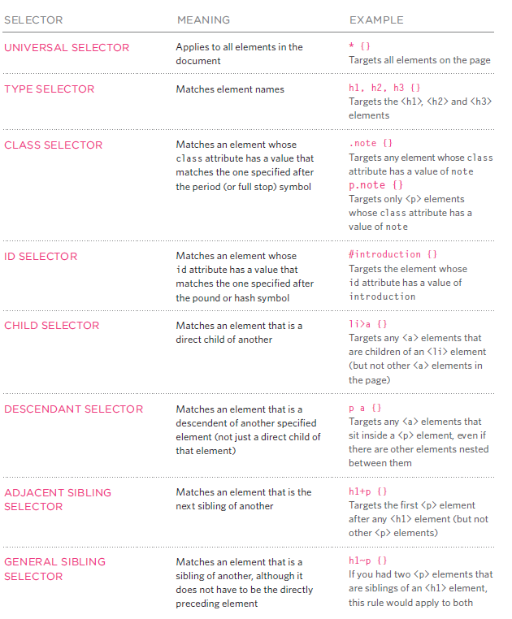

# HTML ( TEXT)
## Headings:
HTML has six "levels" of headings:
`<h1>` is used for main headings and other `<h2><h3><h4><h5><h6>` is used for subheadings.
## Paragraphs
`
`To create a paragraph.
###  some tag to make text bold and italic:
`<b> make text bold.</b>`
`<i> make text italic</i>`
*** How can i write chemical formulas  or number to a power ?***
using these tags  `` and ``
* *white space collapsing:*When the browser comes across two or more spaces next to each other, it only displays one space. Similarly if it comes across a line break,it treats that as a single space too.
* *empty elements:* elements that do not have any words between an opening and closing tag , it is usually has only one tag.
` ` this tag for add a line break inside the middle of a paragraph.
` 
` this tag for To create a break between themes — such as a change of topic in a book or a new scene in a play — you can add a *horizontal rule* between sections
* *Semantic Markup*There are some text elements that are not intended to affect the structure of your web pages, but they do add extra information to the pages — they are known as semantic markup.
`<strong>`element indicates that its content has strong importance.
`<em>`indicates emphasis that subtly changes the meaning of a sentence.
`<blockquote>`is used for longer quotes that take up an entire paragraph.
`<q>`is used for shorter quotes that sit within a paragraph.
`<abbr>` abbreviation or an acronym,A title attribute on the opening tag is used to specify the full term.
`<cite>` element can be used to indicate where the citation is from.
Browsers will render the content of a `<cite>` element in italics.
`<dfn>` The` <dfn>` element is used to indicate the defining instance of a new term.
`<address>` to contain contact details for the author of the page.like a physical address,phone number or email address.
`<ins>` underlined.
`<del>`has a line through it.
`<s>`indicates something that is no longer accurate or relevant (but that should not be deleted).

# Introducing CSS :
CSS (*Cascading Style Sheets*): is use to describes how html elements will appear.
there are many ways to use it 
1. inline : using *attribute* inside html tag name *style* .
2. Internal :in the `<head>`tag in html page  using `` and inside this tag write css rules.
3. External : write css rules in a separate file with extention like that  `namefile.css` then like this file with html page through this way:
-in the `<head>`tag  write `<link>` tag with this attribute 
*href* This specifies the path to the CSS file 
*type* This attribute specifies the type of document being linked to ,The value should be text/css.
*rel* This specifies the relationship between the HTML page and the file it is linked to. The value should be stylesheet when linking to a CSS file.
### how we write CSS rules :

*How Css Rules Cascade?
If there are two or more rules that apply to the same element, it is important to understand which will take precedence. LAST RULE ,SPECIFICITY ,IMPORTANT .

# Basic JavaScript Instructions:
* *STATEMENTS*
A script is a series of instructions that a computer can follow one-by-one.
Each individual instruction or step is known as a statement.Statements should end with a semicolon.
* *COMMENTS* to explain what your code does,it can help you and others who read your code.
`/* ---  */ ` MULTI-LINE COMMENTS.
` // ` SINGLE-LINE COMMENTS.
* WHAT IS A VARIABLE ?
A script will have to temporarily store the bits of information it needs to do its job.It can store this data in variables.
the data stored in a variable can change (or vary) each time a script runs.
* how to declare variables ?
create the variable and giving it a name .
example:` var variableName ;`
* how  to assign a value to variables ?
after you create variable you can tell it what information you would like it to store for you. using assignment operator `=` .
example:` variableName='name';`
* DATA TYPES :
1. NUMERIC DATA TYPE
The numeric data type handles
numbers. exmple: 0.75 
2. STRING DATA TYPE
The strings data type consists of letters and other characters.
example: ' hi '
3. BOOLEAN DATA TYPE
Boolean data types can have one of two values: true or false.
* escaping :using a backwards slash (or "backslash") before any type of quote mark that appears within a string (The backwards slash tells the interpreter that the following character is part of the string,rather than the end of it.)
* SHORTHAND FOR CREATING VARIABLES :
Here are three variations of how to declare variables and assign them values :
1. Variables are declared and values assigned in the same statement.
2. Three variables are declared on the same line, then values assigned to each.
3. Two variables are declared and assigned values on the same line. Then one is declared and assigned a value on the next line.
4. . Here, a variable is used to hold a reference to an element in the HTML page. This allows you to work directly with the element stored in that variable.
*notice* : Once you have assigned a value to a variable, you can then change what is stored in the variable later in the same script.
* ARRAYS:
An array is a special type of variable. It doesn't just store one value; it stores a list of values.
* CREATING AN ARRAY:
- array literal :
`colors= ['white','black','custom'];`
You can also write each value on a separate line.
- array constructor :
var colors = new Array('white ' ,'black','custom ' );
*notice*
 Values in an array are accessed as if they are in a numbered list. It is important to know that the numbering of this list starts at zero (not one).
 * ACCESSING & CHANGING VALUES IN AN ARRAY :
 To access a value from an array, after the array name you specify the index number for that value inside square brackets.

 # Decisions and Loops :
 * There are  often  several places in script where decisions are made that determine which lines of code shouid be run next .
 * there  are two components to decision:
 1. an expression is evaluated ,which return a value .( true or false ).
 2. a conditional statement says what to do in a given stiuation .
  * comparison  operators :
  - `==` is equal to 
  - `!=` is not equal to
  - `===`  strict equal to 
  - `!==` strict not equal to 
  - `>` greater than
  - `< ` less than
  - `>=`  greater than or equal to 
  - `<=` less than or equal to 
  * logical operator :
  - `&&` logical AND 
  - `||` logical OR
  - `!` logical NOT 
   ### IF statements :
   it evaluates (or checks) a condition .if the condition evaluates ti true , any statements in the subsequent code block are excuted .
   * Type if statement   :
     1. ` if (condition){code to execute if value is true ; }`
     2. ` if (condition){code to execute if value is true ; }else {code to execute if value is false ; }`
