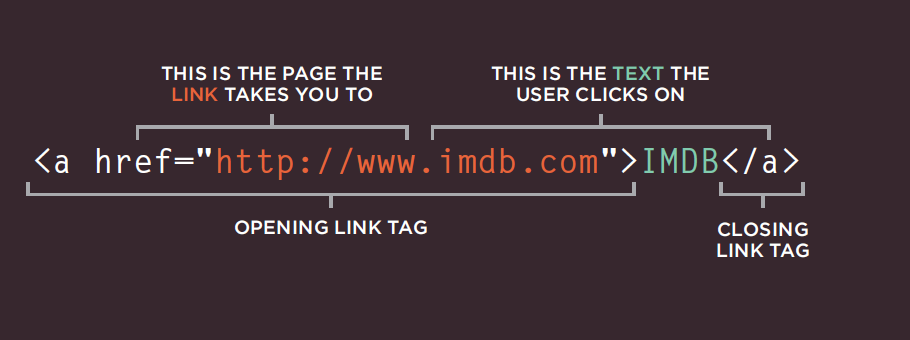
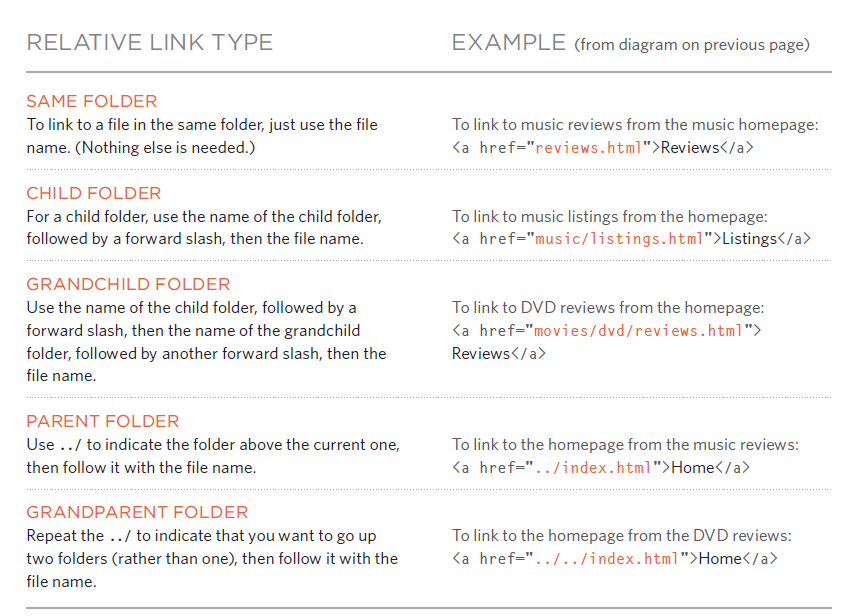

# LINKS :
* Links are the defining feature of the web because they allow you to move from one web page to another — enabling the very idea of browsing or surfing.
* *types of links :*
- Links from one website to another
- Links from one page to another on the same website
- Links from one part of a web page to another part of the
same page
- Links that open in a new browser window
- Links that start up your email program and address a new
email to someone
* *Writing Links:*
- Links are created using the `` element.which has an attribute called `href`

 
 * Linking to Other Sites:
 -the value of the href attribute will be the full web address for the site, which is known as an *absolute* URL.
 * Linking to Other Pages on the Sa me Site :
 - You can use a shorthand known as a relative URL.
       1. If all the pages of the site are in the same folder, then the value of the href attribute is just the name of the file.
       2. If you have different pages of a site in different folders, then you can use a slightly more complex syntax to indicate where the page is in relation to the current page .
 * *Directory Structure*   
 - On larger websites it's a good idea to organize your code by placing the pages for each different section of the site into a new folder Folders on a website are sometimes referred to as directories.  
  - root :The top-level folder that contains all of the other files and folders for a website.
  - The relationship between
files and folders on a website is described using the same terminology as a family tree.
- The main homepage of a site written in HTML (and the homepages of each section in a child folder) is called index.html.
- *Relative URLs* can be used when linking to pages within your own website. They provide a shorthand way of telling the browser where to find your files.

* Email Links:
- `<a href="mailto:jon@example.org">Email Jon</a>`
* Opening Links in a New Window:
- the target attribute on the opening `<a>` tag. The value of this attribute should be _blank.
* You can use the id attribute to target elements within a page that can be linked to.
# Layout:
- Controlling the Position of Elements :
- positioning schemes:
1.  Normal flow
2. Relative Positioning 
3. Ab solute positioning 
* box offset:
use this properties to tell the browser how far from the top or bottom and left or right it should be placed.
* Screen Sizes:
- Different visitors to your site will have different sized screens that show different amounts of information, so your design needs to be able to work on a range of different sized screens.
* Screen Resolution:
Resolution refers to the number of dots a screen shows per inch. Some devices have a higher resolution than desktop computers and most operating systems allow users to adjust the resolution of their screens.

# Functions, Methods, and Objects: 
- WHAT IS A FUNCTION? 
Functions let you group a series of statements together to perform a specific task. If different parts of a script repeat the same task, you can reuse the function (rather than repeating the same set of st atements).
- DECLARING FUNCTIONS :
* `function sayHello() { document.write('hello');}`
- CALLING A FUNCTION :
* ` sayHello();`
-  DECLARING FUNCTIONS THAT NEED INFORMATION :
* `function getArea(width, height){ return width*height;}`
- CALLING A FUNCTION THAT NEED INFORMATION :
* ` getArea(4,8);`
- VARIABLE SCOPE:
* The location where you declare a variable will affect where it can be used within your code. If you declare it within a function, it can only be used within that function. This is known as the variable's *scope*.
 
 # 6 Reasons for Pair Programming :
 - *pair programming :* is the practice of two developers sharing a single workstation to interactively tackle a coding task together.
 - How does pair programming work?
 two roles: 
 1. the Driver :is the programmer , write code ,deal with computer.
 2. the Navigator: is uses his words to guide the Driver, thinks about the big picture, look up solutions and documentation.
 - Why pair program?
 1.  Greater efficiency: long time but produces higher-quality code .
 2. Engaged collaboration : both programmers are more focused than if they were working alone.
 3. Learning from fellow students :working with a teammate can expose developers to techniques they otherwise would not have thought of.
 4. Social skills :When working with someone who has a different coding style, communication is key. 
 5. Job interview readiness :Pair programming strengthens all of the important skills to job interview.
 6. Work environment readiness:Many companies that utilize pair programing expect to train fresh hires from CS-degree programs on how they operate to actually deliver a product.
