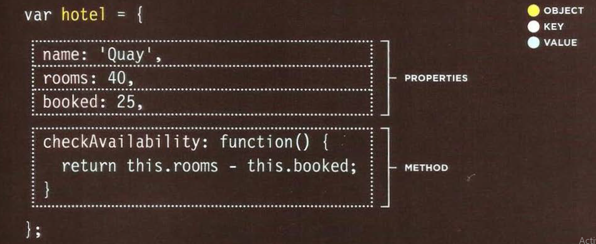

# WHAT IS AN OBJECT ?
Objects group together a set of variables and functions to create a model of a something you would recognize from the real world. In an object, variables and functions take on new names.
- IN AN OBJECT: VARIABLES BECOME KNOWN AS PROPERTIES
- IN AN OBJECT: FUNCTIONS BECOME KNOWN AS METHODS
- If a variable is part of an object, it is called a *property*
- If a function is part of an object, it is called a *method*.
- *key*:name to properties and methods.
* Creating an Object : literal notation 

* Accessing an Object and dot notation
 

# Document Object Model (DOM)
- The Document Object Model (DOM) specifies how browsers should create a model of an HTML page and how JavaScript can access and update the contents of a web page while it is in the browser window.
* THE DOM TREE IS A MODEL OF A WEB PAGE
- As a browser loads a web page, it creates a model of that page. The model is called a DOM tree, and it is stored in the browsers' memory. It consists of four main types of nodes:
1. THE DOCUMENT NODE: 
2. ELEMENT NODES :
3. ATTRIBUTE NODES :
4. TEXT NODES :
* WORKING WITH THE DOM TREE
- Accessing and updating the DOM tree involves two steps:
1. Locate the node that represents the element you want to work with.
2. Use its text content, child elements, and attributes.
* ACCESSING ELEMENTS:
- DOM queries may return one element, or they may return a Nodelist, which is a collection of nodes
* METHODS THAT RETURN A SINGLE ELEMENT NODE:
- `getElementByld( 1 id 1)`
- `querySel ector( 1css selector ')`
* METHODS THAT RETURN ONE OR MORE ELEMENTS (AS A NODELIST):
- `getEl ement sByClassName( 1class 1)`
- `getEl ementsByTagName( 1 tagName 1)`
- `querySelectorAll ( 1css select or •)`
* SELECTING ELEMENTS: 
- Use id attributes
- Use class attributes
- by tag the name 
- Use CSS selectors
* *TRAVERSING THE DOM* 
When you have an element node, you can select another element in relation to it using these five properties. This is known as traversing the DOM.

