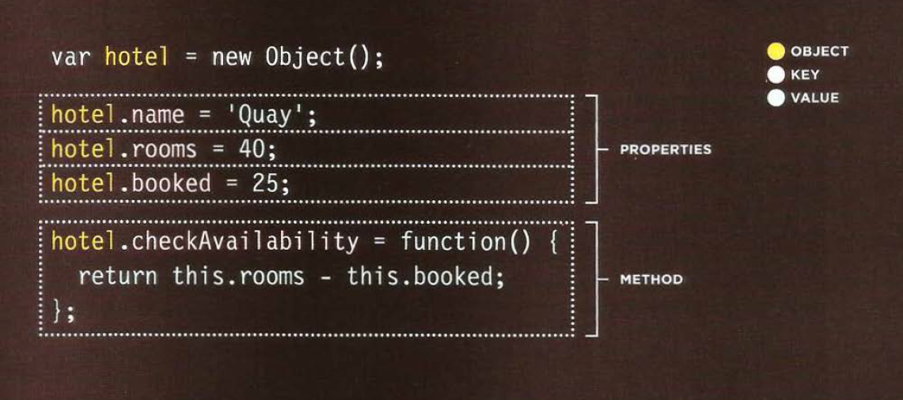
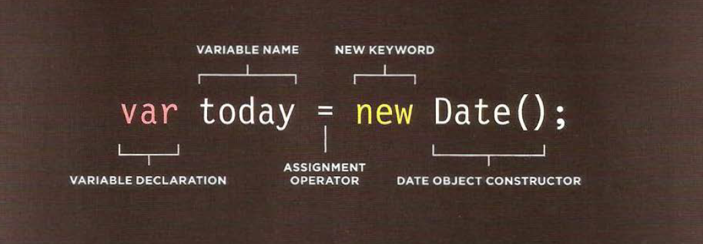

# Domain Modeling:
- is the process of creating a conceptual model in code for a specific problem. And a domain model that's articulated well can verify and validate your understanding of that problem.
# Table 
* What's a Table?
- A table represents information in a grid format Examples of tables include financial reports, TV schedules, and sports results
- Grids allow us to understand complex data by referencing information on two axes.
- Each block in the grid is referred to as a *table cell*. In HTML a table is written out row by row.
* table element
- `<table>` to create a table
- `<tr>` start of each row
- `<td>` Each cell of a table is represented using a  `<td>`element
- `<th>`to represent the heading for either a column or a row.
* attribute: 
- `colspan`  used for how many columns that cell should run across.
- `rowspan` used for how many rows a cell should span down the table.
* Long Tables: 
There are three elements that help distinguish between the main content of the table and the first and last rows
1. `<thead>` The headings of the table should sit inside the `<thead>` element.
2. `<tbody>` The body should sit inside the `<tbody>` element.
3. `<tfoot>` The footer belongs inside the`<tfoot>` element.

# Functions, Methods, and Objects
* creating an object : 
- literal notation
- constructor notation :
*  *constructor notation* 
- the new keyword and the object  constructor create a blank object .
- you can then add properties and methods to object.

- to update the value of properties use `.` or `[]`
- to delete a property use ` delete`keyword
- The *this* keyword is used instead of the object name to indicate that the property or method belongs to the object that this function creates. 
- the *new* followed by a call to the function create a new object .
- the properties of each object are given as arguments to the function .

* RECAP: STORING DATA:
-In JavaScript, data is represented using name/value pairs.To organize your data, you can use an array or object to group a set of related values. In arrays and objects the name is also known as a key. 
* Arrays are objects:
- array actually a special type of object .they hold a related set of key/value pairs (like all object ), but the key for each value is its index number.
* *Array of Objects & Objects in Arrays* 
you can combine array and objects to create complex data structures :
- array can store a series of objects.
- objects can also hold arrays (as values of their properties).
* WHAT ARE BUILT-IN OBJECTS?
- Browsers come with a set of built-in objects that represent things like the browser window and the current web page shown in that window. These built-in objects act like a toolkit for creating interactive web pages.
Three groups of build-in object :
1. browser object model
2. document object model 
3. global javascript object
 
 * creating an instance of the date object
 - in order to work with dates , you create an instance of the `Date` object.
 - you can then specify the time and date that you want it to represent .
 
