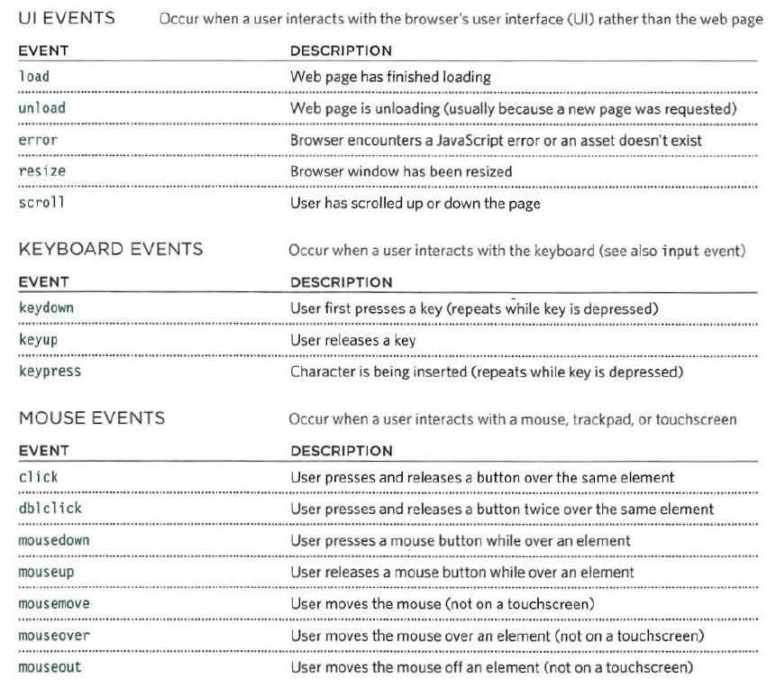
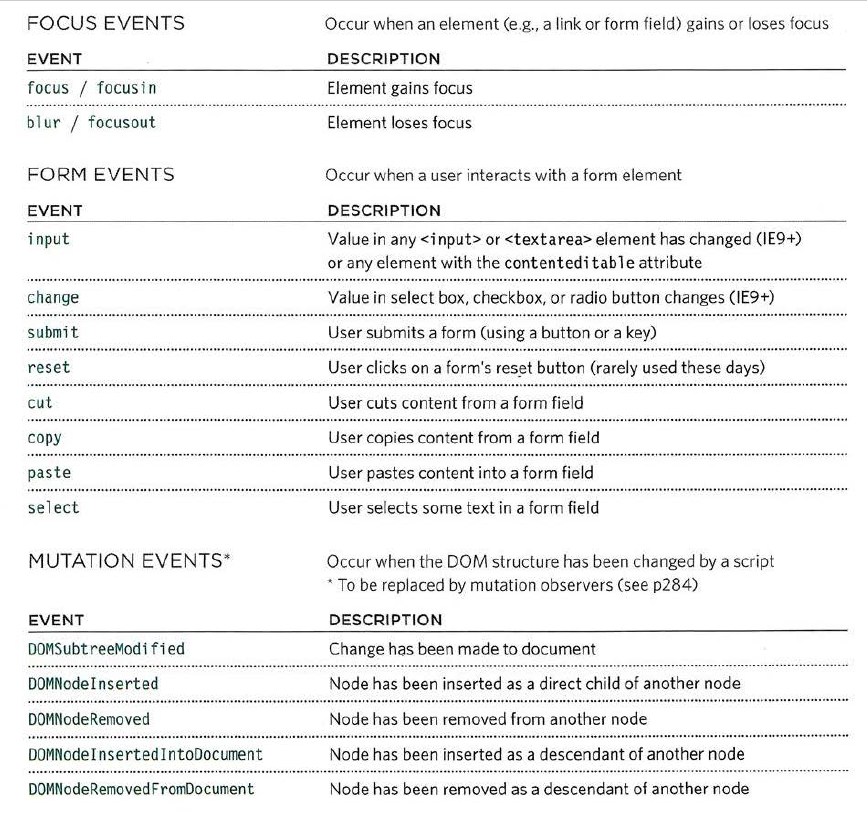

# Forms  
* How Forms Work ?
- A user fills in a form and then presses a button to submit the information to the server.
- A form may have several form controls, each gathering different information. The server needs to know which piece of inputted data corresponds with which form element.
- You should never change the name of a form control in a page unless you know that the code on the server will understand this new value.
* Form Structure:`<form>`
* Text Input `<input type="text">`
* Password Input `<input type="password">`
* Text area `<textarea>`
* Radio Button ` <input type="radio">`
* Chec kbox `<input type="checkbox">`
* Drop Down List Box `<select> <option>`
* Multiple Select Box `<select multiple="multiple">`
* File Input Box `<input type="file">`
* Submit button `<input type="submit"> `
* Image Button `<input type="image">`

# LISTS , TABLES AND FORMS with css :
- | properties | value|
|` list-style-type`| none ,disc,circle,square|
|----|---|
| `list-style-image`|    |
|---|----|
|`list-style-position`|outside,inside|
|-----|---|
|`list-style`|    |
|---|---|

# Event 
When you browse the web, your browser registers different types of events. It's the browser's way of saying, "Hey, this just happened." Your script can then respond to these events.
 * DIFFERENT EVENT TYPES

