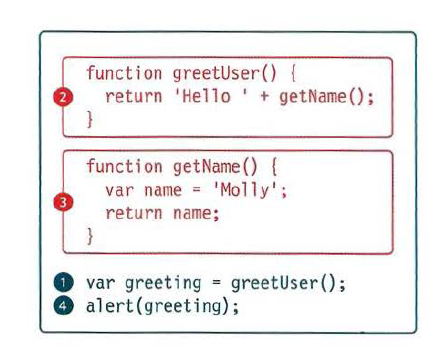

# Error Handling & Debugging
* ORDER OF EXECUTION:

The Stack :
- the javascript interpreter processes one line of code at a time .
- when a statement needs data from anthor function , it stacks (or riples) the new function on top of the current task.  
* UNDERSTANDING SCOPE :
In the interpreter, each execution context has its own va ri ables object. It holds the variables, functions, and parameters available within it.Each execution context can also access its parent's v a ri ables object.
* UNDERSTANDING ERRORS:

* BROWSER DEV TOOLS & JAVASCRIPT CONSOLE
|CHROME/ OPERA| INTERNET EXPLORER
|-----|----|
| On a PC, press the F12 key or:|Press the F12 key or:|
| Go to the options menu (or three line menu icon)|Go to the settings menu in the top-right|
 | Select Toots or More tools.|Select developer tools|  |
| Select JavaScript Console or Developer Tools|   |
|On a Mac press Alt + Cmd + J. Or:|  |
| Go to the View menu.|   |
| Select Developer.|  |
| Open the JavaScript Console or Developer Tools|   |
|option and select Console.|   |
|-----|---|
* CONSOLE METHODS:
- `console . log ()`
- `con so 1 e.info()`
- `consol e.warn()`
- `console .error ()`
- `console. group ()`
- `console .groupEnd ()`
- `console. table ()`
- `console. assert()`
* HANDLING EXCEPTIONS:
- TRY
- CATCH
- FINALLY

