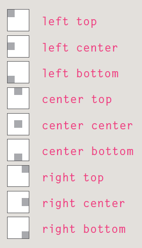

# HTML Images , AUDIO ,VIDEO
## Images
* Controlling sizes of images in CSS
-  using the `width` and `height` properties in CSS
* Aligning images Using CSS `float` property 
* Centering images in CSS : make it block element then use `text-align` and `margin:auto`
* Repeating Images:`background-repeat` `background-attachment`
* Background Images `background-image: url("image name.gif");`
* Background Position : `background-position`

* shorthand `background`
- The properties must be specified in the following order, but you can miss any value if you do not want to specify it.
1. background-color
2. background-image
3. background-repeat
4. background-attachment
5. background-position
## Search Engine Optimization (SEO)
- is the practice of trying to help your site appear nearer the top of search engine results when people look for the topics that your website covers.
- SEO is often split into two areas:
1. on-page techniques 
2. off-page techniques
* *on-page techniques* 
In every page of your website there are seven key places where keywords (the words people might search on to find your site) can appear in order to improve its findability
1. Page Title
2. URL/Web Address
3. Headings
4. Text
5. Link Text
6. Image Alt Text
7. Page Descriptions
* FTP & Third Party Tools
- To transfer your code and images from your computer to your hosting company, you use something known as File Transfer Protocol.

# audio and video 
- The `<video>` and `<audio>` elements allow us to embed video and audio into web pages. 
- you can control video and audio players programmatically  `HTMLMediaElement` like`HTMLMediaElement.play()` `HTMLMediaElement.pause()`
* Implementing the JavaScript
- `document.querySelector()`