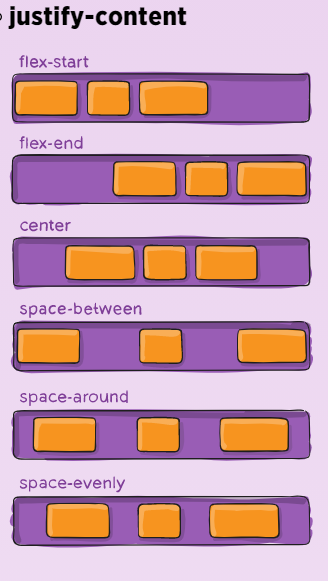
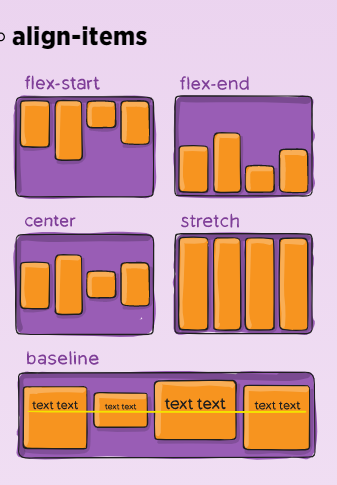
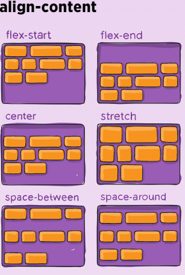

# Javascript Templating Language and Engine—Mustache.js with Node and Express
* Javascript Templating 
- technique to render client-side view templates with Javascript by using a JSON data source
write as tag inside HTML file . `<template>`   that will either insert variables or run programming logic.

* Mustache 
-  is a logic-less template syntax. It can be used for HTML, config files, source code — anything.
-  Mustache is a specification for a templating language. In general, we would write templates according to the Mustache specification, and it can then be compiled by a templating engine to be rendered to create an output.
***It is often referred to as “logic-less” because there are no if statements, else clauses, or for loops. Instead, there are only tags. Some tags are replaced with a value, some nothing, and others a series of values.***
- mustache.js is an implementation of the mustache template system in JavaScript.
`Mustache.render(“Hello, {{name}}”, { name: “Sherlynn” });`
`// returns: Hello, Sherlynn`
* Mustache-Express
- let you use mustache with Node and Express
- Mustache Express lets you use Mustache and Express together easily.
***Yarn is a package manager for your code. It allows you to use and share (e.g. JavaScript) code with other developers from around the world. ... Yarn allows you to use other developers' solutions to different problems, making it easier for you to develop your software***
+ To install:
- With Yarn:
$ yarn add mustache-express
- or with NPM:
`$ npm install mustache --save`

# Flexbox
+ ***Properties for the Parent***
(flex container)
- `display`
This defines a flex container; inline or block depending on the given value. It enables a flex context for all its direct children.
- `flex-direction` 
This establishes the main-axis, thus defining the direction flex items are 
- `flex-wrap`
By default, flex items will all try to fit onto one line.you can allow the items to wrap as needed with this property.
- `flex-flow`
This is a shorthand for the `flex-direction` and `flex-wrap` properties,
- `justify-content`
This defines the alignment along the main axis

- `align-items`
This defines the default behavior for how flex items are laid out along the cross axis on the current line

- `align-content`
>This aligns a flex container’s lines within when there is extra space in the cross-axis, similar to how justify-content aligns individual items within the main-axis.

 + ***Properties for the Children***
(flex items)
- `order` By default, flex items are laid out in the source order.
- `flex-grow` This defines the ability for a flex item to grow if necessary.
- `flex-shrink`
This defines the ability for a flex item to shrink if necessary.
- `flex-basis`
This defines the default size of an element before the remaining space is distributed.
- `flex`
This is the shorthand for `flex-grow`, `flex-shrink` and `flex-basis` combined.
- `align-self`
