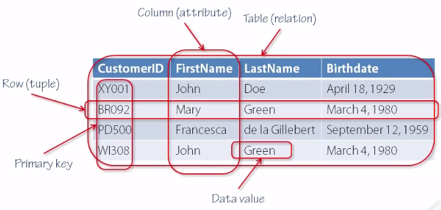

# Structured Query Language  
Structured Query Language (aka SQL):
is query language allow you to query,manipulate and transform data from database that organize into rows and columns.
- All sql databases(SQLite, MySQL, Postgres, Oracle and Microsoft SQL Server) support the commen sql language standerd
- Relational Databases:

* some sql query :
- SELECT : it get the spacific data that you needed from database  
- `SELECT  column1 , column2 FROM tableName WHERE condition  ORDER BY column ASC/DESC LIMIT num_limit OFFSET num_offset;`
- INSERT : to add new value to rows as you ordered your columns
`INSERT INTO tableName (column1,column2, …) VALUES (value1_or_expr, value2_or_expr, …),(value1_or_expr_2 value2_or_expr_2, …),…; `
-UPDATE: to change date ; 
`UPDATE tableName SET column1 = value1, column2 = value2,  …  WHERE condition;`
- DELETE : it is remove any data you want jsut be sure to use `where ` with appropriate condition or you will remove all the table or wrong data.
` DELETE FROM tableName WHERE condition;`
- CREATE TABLE : 
` CREATE TABLE tableName ( column1 DataType , column2 DataType, … );`
- ALTER TABLE: to add column 
`ALTER TABLE tableName ADD column DataType; `

